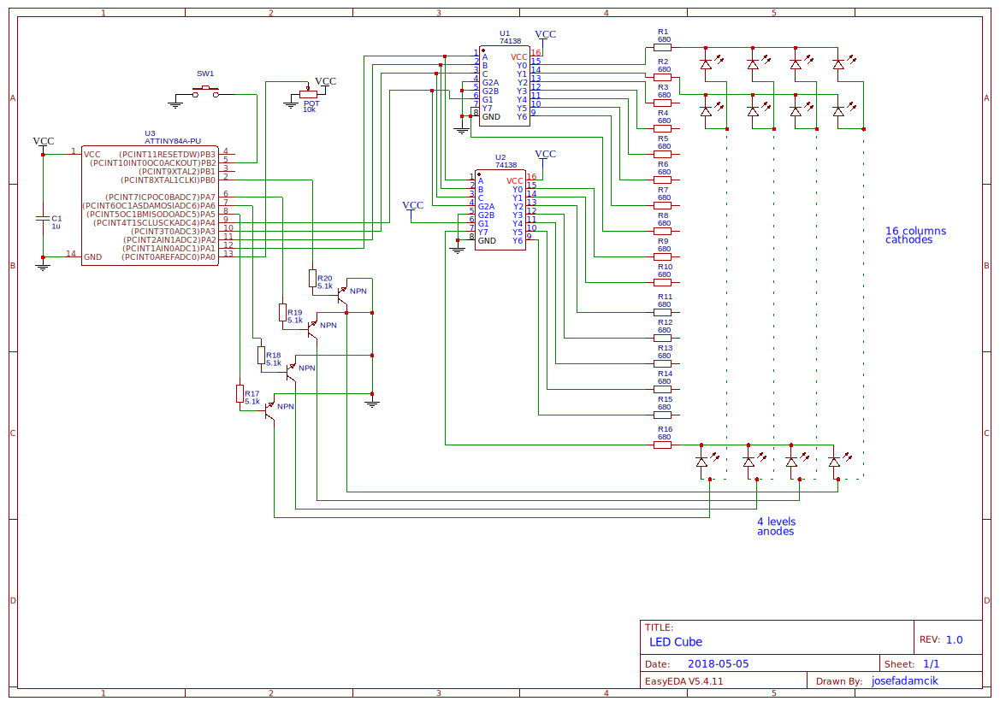

# led cube 4x4x4

Arduino code for driving simple 4x4x4 LED cube. 

This particular cube uses two [74138 3to8 decoders](http://www.ti.com/lit/ds/symlink/sn74ls138.pdf) to select a column and 4 transistors to select a level.
Level represents joined anodes of 16 LEDs on one level. Column represents verticaly joined cathodes of 4 LEDs. There are only 8 pins needed to control the cube. Only one led in every level can be lit at a time. This makes max currents very manageable by microcontroller (circa 7 mA). Unfortunattely it also limits performance of cube when used in "persistence of vision" scenarios.

[There are more detials available on my website.](https://josef-adamcik.cz/electronics/led-cube-4x4x4x-attiny84-74138.html)

## Schematic

[Also available on EasyEDA.](https://easyeda.com/josefadamcik/ledcubedriver)

## More 

- [Gallery on imgur](https://imgur.com/a/ktky9d0)
- [Video on YT ](https://www.youtube.com/watch?v=VQNsp-L_gPY)

